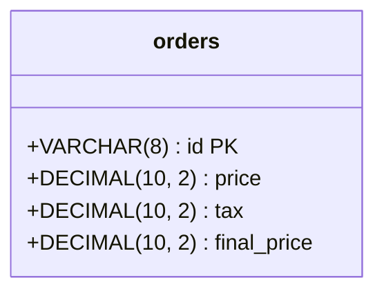

# Clean Architecture
Clean Architecture Challenge

# 🚀 Run the project

1. Copy the env files using this command:
    ```shell
      $ cp .mysql.env.example .mysql.env
      $ cp .rabbit.env.example .rabbit.env
      $ cp .env.example .env
    ```
2. You can use the default credentials inside the `*.example` files, or you can replace them with your own credentials.
3. Run the command `make run`, this command will create the containers declared in the file `./docker-compose.yaml`.
4. You need to apply the migrations: `make migrate/up`.
5. So, that's it! you are ready to test the app. 🏁

# 💿 SQL
- We are using the MySQL database.
- This is the diagram of the table we are using:


# 🧪 Test the project
> ⚠️ **Generate UUID:**
>
> You can use `uuidgen` command to generate UUIDs
## REST
1. You can open the file `./api/create_order.http` to insert a new order.
2. You can open the file `./api/list_order.http` to list the created orders.

## graphQL
Open the server: http://127.0.0.1:8088 and execute the following queries:
1. To create orders:
   ```graphql
   mutation createOrder {
      createOrder(
        input: {id: "0999B54C-EB83-4F70-981A-08F56324A5F3", Price: 129.54, Tax: 0.77}
      ) {
            id
            Price
            Tax
            FinalPrice
         }
   }
   ```
2. To list orders:
   ```graphql
   query createOrder {
     listOrder {
         id
         Price
         Tax
         FinalPrice
     }
   }
   ```
