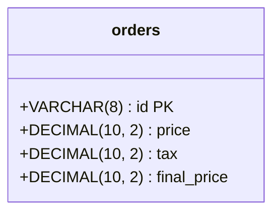

# Clean Architecture
Clean Architecture Challenge

# 🚀 Run the project

1. Copy the env files using this command:
    ```shell
      $ cp .mysql.env.example .mysql.env
      $ cp .rabbit.env.example .rabbit.env
      $ cp .env.example .env
    ```
2. You can use the default credentials inside the `*.example` files, or you can replace them with your own credentials.
3. Run the command `make run`, this command will create the containers declared in the file `./docker-compose.yaml`.
4. You need to apply the migrations: `make migrate/up`.
5. So, that's it! you are ready to test the app. 🏁

# 💿 SQL
- We are using the MySQL database.
- This is the diagram of the table we are using:

