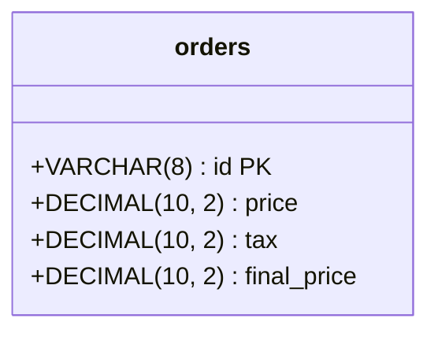
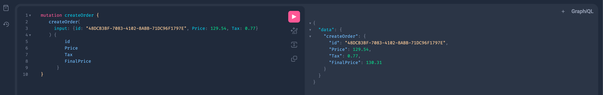
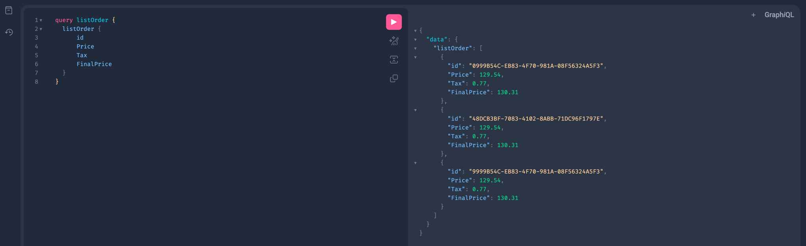
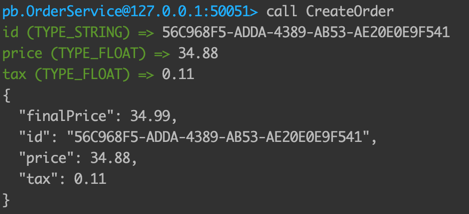
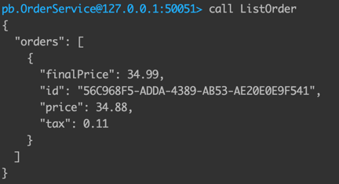

# Clean Architecture
Clean Architecture Challenge

# 🚀 Run the project

1. Copy the env files using this command:
    ```shell
      $ cp .mysql.env.example .mysql.env
      $ cp .rabbit.env.example .rabbit.env
      $ cp .env.example .env
    ```
2. You can use the default credentials inside the `*.example` files, or you can replace them with your own credentials.
3. Run the command `make run`, this command will create the containers declared in the file `./docker-compose.yaml`.
4. You need to apply the migrations, run the following commands in your local machine (no container needed):
   - `export $(cat .env | xargs)`.
   - `make migrate/up`.
5. So, that's it! you are ready to test the app. 🏁

# 💿 SQL
- We are using the MySQL database.
- This is the diagram of the table we are using:


# 🧪 Test the project
> ⚠️ **Generate UUID:**
>
> You can use `uuidgen` command to generate UUIDs to create a different ID.

## REST
1. You can run the file `./api/create_order.http` to insert a new order.
2. You can run the file `./api/list_order.http` to list the created orders.

## GraphQL
You not need to install any extra software. Open the server: http://127.0.0.1:8088 and execute the following queries:
1. To create orders, execute this mutation
   ```graphql
   mutation createOrder {
      createOrder(
        input: {id: "48DCB3BF-7083-4102-8ABB-71DC96F1797E", Price: 129.54, Tax: 0.77}
      ) {
            id
            Price
            Tax
            FinalPrice
         }
   }
   ```
   
2. To list order, execute this query
   ```graphql
   query listOrder {
     listOrder {
         id
         Price
         Tax
         FinalPrice
     }
   }
   ```
   

## GRPC
1. You can download the **evans CLI** from [this link](https://github.com/ktr0731/evans).
2. Run the evans client by tipping this command: 
   ```sh
   evans --proto internal/infra/grpc/protofiles/order.proto repl
   ```
3. To create a new order, in the command line, type `call CreateOrder`
   
4. To list orders, in the command line, type `call ListOrder`
   
