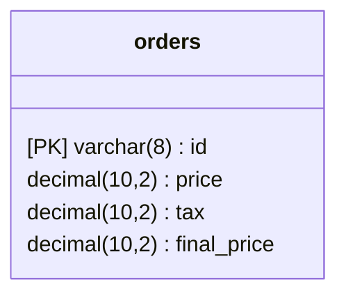

# Clean Architecture
Clean Architecture Challenge

# 🚀 Run project

## Production
1. Copy the env files using this command:
    ```shell
      $ cp .mysql.env.example .mysql.env
      $ cp .rabbit.env.example .rabbit.env
      $ cp .env.example .env
    ```
2. You can use the default credentials inside the `*.example` files.
3. Or you can replace them with your own credentials.
4. Run the command `make run`.

## SQL
- It is using the MySQL database.
- You can see the SQL script in `./sql/creation.sql`

